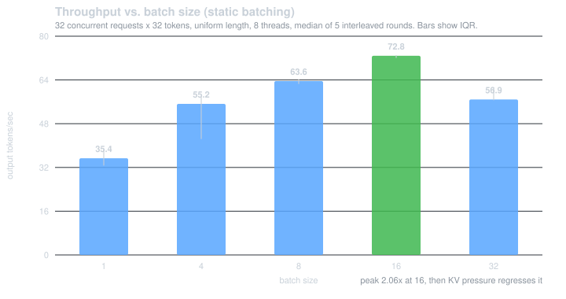
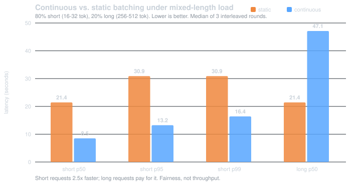

# microvllm

A miniature LLM inference server in C++20, built to understand what makes serving fast under
concurrent load. It implements the techniques real engines use — **continuous batching**,
**chunked prefill**, and a **block-based KV-cache allocator** with admission control,
preemption, and prefix sharing — around llama.cpp as the tensor backend.

The value here is the serving system, not the model math. llama.cpp does the matrix
multiplications; the queue, scheduler, batching loop, cache accounting, and HTTP layer are
the project.

```bash
curl -X POST localhost:8080/generate \
  -d '{"prompt":"The capital of France is","max_tokens":16,"temperature":0}'
# {"text":" Paris. It is the largest city in Europe...","finish_reason":"max_tokens",
#  "usage":{"prompt_tokens":5,"completion_tokens":16,"total_tokens":21}}
```

---

## Results

All numbers measured on one machine (Intel Core Ultra 7 155U, 15 W laptop part, CPU-only,
Ubuntu 24.04 under WSL2) against Qwen2.5-0.5B-Instruct Q4_K_M. Absolute throughput is
laptop-class; the **relative comparisons are the claim**. Methodology — interleaved arms,
median and IQR over repeated rounds, fixed thread count — is in
[docs/benchmarks.md](docs/benchmarks.md).

### Batching: 2.06× throughput



Decode is memory-bandwidth-bound: at batch 1, streaming all 463 MiB of weights through
memory produces a single token; at batch 16 the same traffic produces sixteen. Throughput
peaks at **2.06×** and then *regresses* at 32, where the KV working set stops fitting the
cache hierarchy and batch occupancy decays as members finish at different steps.

### Continuous batching: 60% lower short-request latency



Under mixed-length load (80% short, 20% long), static batching holds every request until the
batch's *slowest* member finishes — its short and long p50 are identical at 21.44 s, the
signature of lockstep. Continuous batching retires each sequence the moment it is done.

**This is a fairness win, not a throughput win, and the difference matters.** Throughput is
flat (0.98×) because the engine was already bandwidth-saturated — the same total work takes
the same total time. What changes is *who waits*. Long requests get **120% slower** as the
cost of short requests getting 2.5× faster. That is the right trade for interactive serving,
where short requests dominate, but it is a trade.

### KV-cache budget: degrade, don't fail

| Pool | Requests OK | Admissions deferred | Preemptions | p50 |
|---|---:|---:|---:|---:|
| 40 blocks (640 tok) | 12 / 12 | 0 | 0 | 2.75 s |
| **10 blocks (160 tok)** | **12 / 12** | **18** | **3** | 5.46 s |

Squeezing the cache makes admission control and preemption engage while **every request
still returns correctly**. A budget is only worth having if exceeding it costs throughput
rather than producing errors.

---

## How it works

```
  HTTP threads (cpp-httplib)              Scheduler thread (owns llama_context)
 ┌──────────────────────────────┐        ┌────────────────────────────────────┐
 │ POST /generate               │        │  step():                           │
 │ POST /generate/stream  (SSE) │        │   1. reap finished, free blocks    │
 │ GET  /metrics  /health       │        │   2. admit from queue (if capacity) │
 └───────────┬──────────────────┘        │   3. build ONE mixed batch:        │
             │ Request + ITokenSink      │      decodes first (1 token each), │
             v                           │      prefills chunk into the rest  │
      ┌──────────────┐   pop             │   4. engine.decode(batch)          │
      │ RequestQueue │ ────────────────► │   5. advance each sequence         │
      │ mutex+condvar│                   │      independently; retire on stop │
      └──────────────┘                   └──────────┬─────────────────────────┘
                                     ┌──────────────┴──────────────┐
                                     v                             v
                          ┌─────────────────────┐      ┌────────────────────┐
                          │  BlockAllocator     │      │   IModelEngine     │
                          │  free list, refcnt  │      ├────────────────────┤
                          │  per-seq page table │      │ LlamaModelEngine   │
                          │  prefix cache (COW) │      │ MockModelEngine    │
                          └─────────────────────┘      └────────────────────┘
```

**One thread touches the model.** `llama_context` is not thread-safe, so all decode work is
funnelled to the scheduler thread. HTTP threads only touch the queue, an atomic cancel flag,
and atomic metrics counters. That narrow surface is what `test_concurrency` hammers under
ThreadSanitizer — and a small surface is what makes a clean TSan run meaningful rather than
an accident of low contention.

**The model sits behind an interface.** `IModelEngine` has a llama.cpp implementation and a
deterministic mock. This is the most load-bearing decision in the project: the scheduler is
unit-testable in milliseconds, CI never downloads a 469 MB model, scheduling cost can be
measured without model compute, and any sanitizer report is necessarily first-party.

Design rationale in [docs/architecture.md](docs/architecture.md).

---

## What the block allocator actually owns

Worth stating plainly, because it is the first thing a careful reader should ask.

**llama.cpp owns the KV bytes** and decides which physical cells a sequence uses. This
project owns the **policy** — who is admitted, who is evicted, how much cache anyone may
hold, what is shared — and mirrors every decision into the backend via
`llama_memory_seq_rm` and `llama_memory_seq_cp`.

It is a real allocator with real invariants (free list, refcounts, per-sequence page tables,
tested as properties over long alloc/free sequences), and the behaviour it produces —
admission control, LIFO preemption, prefix sharing — is real and measurable. But it is a
governor over someone else's memory, not a replacement for it.

**Prefix sharing survives its donor.** When a sequence retires holding a block-aligned
prompt prefix, its KV is copied into a reserved donor slot and kept, so a request arriving
long afterwards still hits. On six requests behind a shared system prompt sent strictly one
after another — nothing overlapping — retention takes the run from **0 hits / 9.9 s** to
**4 hits / 4.4 s**, a 2.25× speedup. Donors are bounded, evicted LRU, and reclaimed *before*
any live sequence is preempted: cache yields to work in progress.

---

## Running it

Development targets **WSL2 / Linux**. ThreadSanitizer has no Windows implementation in either
MSVC or clang-cl, and TSan validation is a core goal. A Windows/MSVC preset exists as a
compile check.

```bash
bash scripts/setup_wsl.sh      # apt deps; verifies asan/tsan/ubsan actually link
bash scripts/fetch_model.sh    # Qwen2.5-0.5B-Instruct Q4_K_M (~469 MB)
cmake --preset wsl-release && cmake --build --preset wsl-release
ctest --preset wsl-release
```

```bash
./build/src/microvllm --model models/qwen2.5-0.5b-instruct-q4_k_m.gguf --quiet
```

Stream tokens as they are generated:

```bash
curl -N -X POST localhost:8080/generate/stream -d '{"prompt":"Count to five:","max_tokens":32}'
```

| Flag | Purpose |
|---|---|
| `--batch-size <n>` | sequences per forward pass |
| `--scheduler continuous\|static` | scheduling policy (the benchmark's two arms) |
| `--prefill-chunk <n>` | prompt tokens per sequence per step |
| `--kv-blocks <n>` / `--block-size <n>` | KV budget — lower it to exercise preemption |
| `--no-prefix-cache` | disable prefix sharing (also selects the faster per-stream KV cache) |
| `--prefix-donors <n>` | prefixes retained past their request's exit (default 4, 0 = off) |
| `--log-requests` | one structured JSON line per request |
| `--mock-echo` | serve without a model, for load testing |

### Observability

`GET /metrics` exposes Prometheus counters (admissions, completions, preemptions, deferrals,
prefix hits, tokens served), gauges (queue depth, KV utilization), and **histograms** for TTFT
and end-to-end latency. `--log-requests` emits per-request timing:

```json
{"event":"request_complete","request_id":2,"prompt_tokens":8,"completion_tokens":16,
 "queue_wait_ms":528.23,"ttft_ms":173.44,"tpot_ms":62.46,"total_ms":1638.57,
 "output_tokens_per_sec":9.76,"finish_reason":"max_tokens"}
```

Latency is decomposed on purpose. Above, request 2 waited 528 ms for capacity but then had a
*faster* first token (173 ms vs 530 ms for request 1) because it joined a batch already
decoding. A single end-to-end number would have hidden both effects; split, a regression is
diagnosable — queue wait means the scheduler is starved, TTFT means prefill got more
expensive, TPOT means decode did.

---

## Testing

**124 tests**, all first-party, all running against the mock engine with no model loaded.

| | |
|---|---|
| Correctness | scripted arrival traces asserting exact admission/retirement order |
| Equivalence | continuous ≡ static output; chunked ≡ whole prefill; streamed ≡ buffered |
| Allocator invariants | no block handed out twice, none leaked, pool exactly whole after 50 mixed cycles |
| Concurrency | 8 producers × 50 requests through a 16-slot queue; 200 concurrent cancellations |
| Sanitizers | ASan, UBSan, and **TSan clean**, concurrency suites repeated **25×** in CI |
| Platforms | gcc 13 (Linux) and MSVC 19.44 (Windows) |

CI runs five jobs on every push: build+test, ASan+UBSan, TSan, TSan×25, and an MSVC compile
check.

---

## Things that went wrong

The bugs are recorded in [docs/benchmarks.md](docs/benchmarks.md) because they are the part
worth reading. Three were only findable with a real model, and three presented as hangs:

- **`--batch-size` above `n_seq_max` aborted the process.** Found by a benchmark arm
  returning zeros. The 60-test suite could not have caught it — the mock's capacity was never
  exceeded.
- **llama.cpp divides `n_ctx` across `n_seq_max`.** So `--ctx 4096` with 16 sequences gave
  each request 256 tokens, and raising the batch size silently shrank everyone's context.
- **Two sequences alternately evicting each other** — 25,000 preemptions, neither
  progressing. Admission reserved only the prompt's blocks, leaving no room to *grow*. Fixed
  with an admission watermark. Found by instrumenting the loop after reasoning from the code
  produced a plausible-but-wrong answer twice.
- **Prefix sharing would abort the server on its first real cache hit.** `llama_memory_seq_cp`
  supports partial copies only on a *unified* KV cache, and the context was using llama.cpp's
  non-unified default. It shipped undetected because the sequential test recorded zero hits,
  so the backend call was never once exercised — the feature "worked" only in the sense that
  nothing had tried it.

---

## Scope

Not in scope: training, writing the transformer, GPU kernels, multi-model routing,
speculative decoding. The model is a dependency; the serving system is the work.

## License

MIT. Vendored llama.cpp is MIT under its own copyright.
